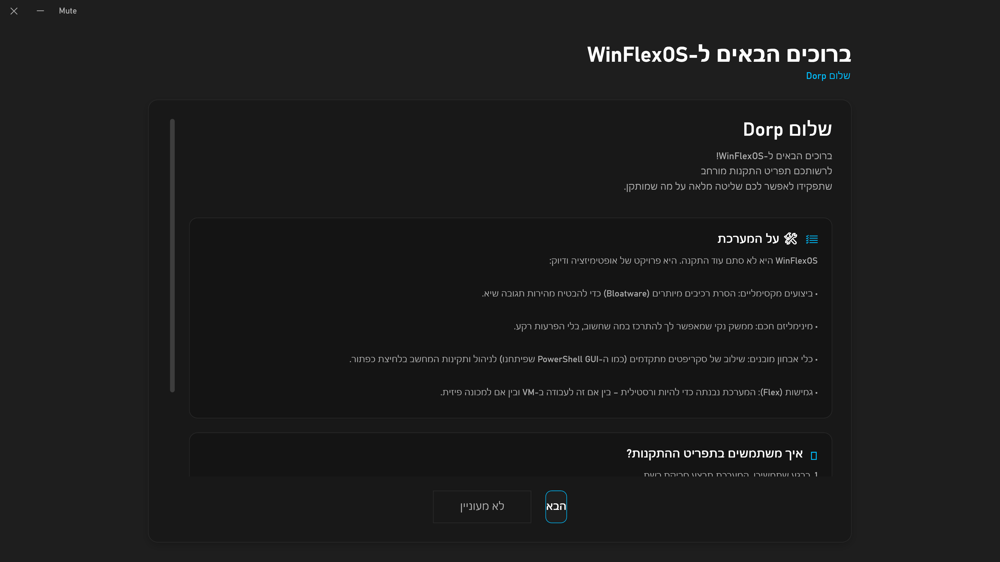

# WinFlexOS Setup Menu Configuration

זהו מאגר הגדרות עבור תפריט ההתקנה של **WinFlexOS**, המופעל אוטומטית לאחר התקנת המערכת.

This repository holds the menu configuration files for **WinFlexOS Setup Wizard**, which runs post-installation of the OS.

## סקירה / Overview
* **תפריט דינמי (Dynamic Menu)**: קובץ ההגדרות `menu.ps1` נמשך מהרשת בזמן אמת עם הפעלת כלי ההתקנה.
* **התקנות שקטות (Silent Installations)**: תוכנות מותקנות בצורה שקטה ברקע באמצעות `winget`.

## קבצים במאגר / Files in Repository
* `menu.ps1`: קובץ הגדרת קטגוריות ותוכנות לטעינה דינמית.
* `WinFlexSetup.png`: צילום מסך של ממשק המשתמש (UI).

